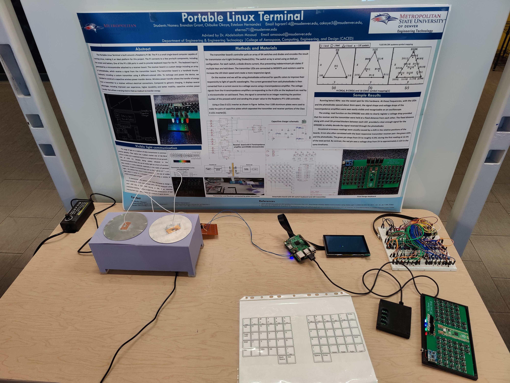

# Portable Linux Terminal with Visible Light Communication Keyboard

This project is a **Raspberry Pi-powered cyberdeck** featuring a **detachable keyboard that transmits keystrokes using visible light communication (VLC)**. Built as a senior capstone, it explores embedded systems, optical signaling, and hardware-software co-design.

## Hardware Overview

- **Main Console**: Raspberry Pi 4, 5" DSI touchscreen, lithium battery + charge regulator.
- **Keyboard Module**: 
  - Raspberry Pi Pico
  - 64-key matrix with diode-protected rows/columns
  - RGB LEDs for VLC (Color Shift Keying + PWM)
  - White LED sync pulses for timing
  - Photodiode-based receiver on console side

## Engineering Focus

- Custom **VLC protocol** using PWM + CSK (color shift keying)
- Clock synchronization via **white LED pulses**
- **MOSFET driver design** and RC constant tuning for LED switching
- Ambient light rejection via photodiode spectral filtering
- Safe aluminum plate-based **power delivery system**
- **3D printed case** with access to all ports + GPIO expansion

## Technologies & Tools

- Embedded C++ (Pico SDK)
- GPIO + PWM signal generation
- Eagle/KiCad (PCB design)
- Linux shell scripting + low-level debugging
- Visible light + photodiode interfacing

## Use Case

This build merges protocol design, practical EE, and embedded dev into a portable proof-of-concept for **optical wireless peripherals**. Ideal for R&D, teaching tools in **embedded comms**, **optoelectronics**, or **secure hardware interfaces**.

## License

MIT License
